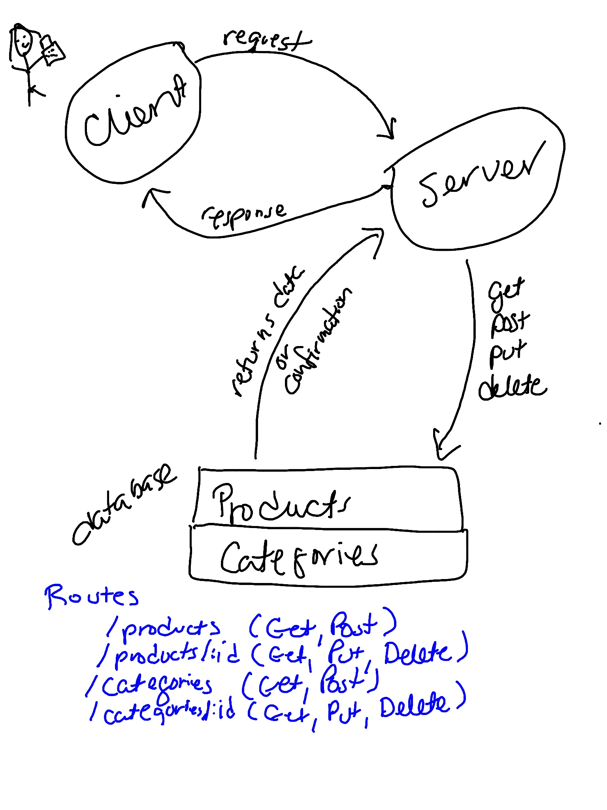

# api-server

This project contains an API server.

### Author: Marlene Rinker

- [Submission PR](https://github.com/marlenerinker-401-advanced-javascript/api-server/pull/11)
- [Tests Report](https://github.com/marlenerinker-401-advanced-javascript/api-server/actions)
- [Swagger Hub](https://app.swaggerhub.com/apis/marlene-rinker/api-server/0.1#/)
- [Heroku deployment](https://app-server-mr401.herokuapp.com/)

### Setup

#### `.env` requirements
PORT=<port> (will default to 3000 if you don't specify here)

MONGODB_ATLAS_URI=mongodb+srv://dbAdmin:<password>@cluster0-2u75g.mongodb.net/<database>?retryWrites=true&w=majority

#### Packages to Install
(see package.json)

dotenv
express
mongoose

For testing:
jest
cf-supergoose

#### Running the app
node index.js 
nodemon index.js

#### Tests
- Unit Tests: `npm test` (run from the `__tests__` folder to run all tests, multiple test files are in that folder)

- Assertions Made:

  - Testing that a product can be added to the database

  - Testing that a product can be found in the database by ID and updated

  - Testing that a product can be found in the database by ID and deleted

  - Testing that a product can be retrieved from the database by ID

  - Testing that all products can be retrieved from the database

  - Testing that a category can be added to the database

  - Testing that a category can be found in the database by ID and updated

  - Testing that a category can be found in the database by ID and deleted

  - Testing that a category can be retrieved from the database by ID

  - Testing that all categories can be retrieved from the database

  - Testing that you can't add on an invalid route

  - Testing that you can't update on an invalid route

  - Testing that you can't get on an invalid route

  - Testing that you can't delete on an invalid route   

  - Testing if timestamp is created

  - Testing if get 404 error message

  - Testing if get 500 error message

  - Testing if request is logged

#### UML

#### Citations

Ashley Biermann helped me with middleware testing.

Paul Depew pointed me in the right direction with some of router functions. He also helped me format the date in my timestamp.

Used the Express.js docs for reference on the timestamp functionality.
