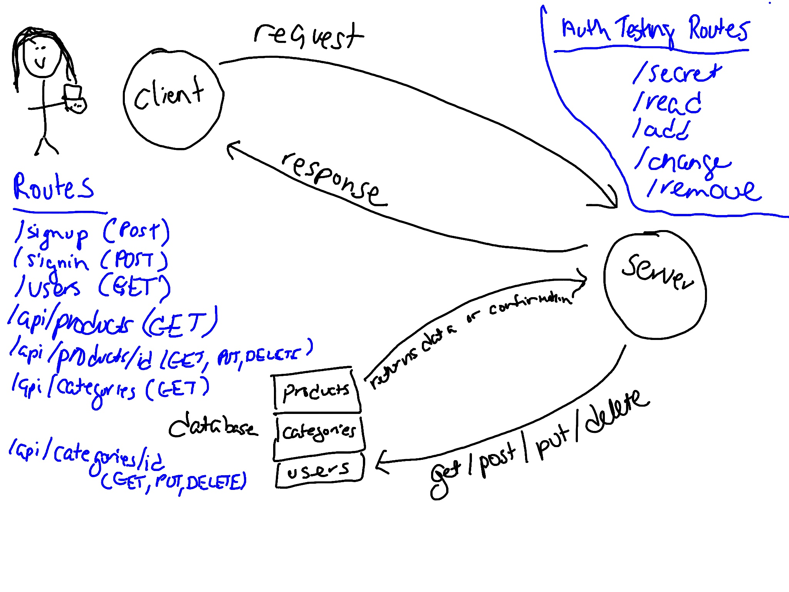

# api-server

This project contains an authenticated API server.

### Author: Marlene Rinker

- [Submission PR](https://github.com/marlenerinker-401-advanced-javascript/authenticated-api-server/pull/1)
- [Tests Report](https://github.com/marlenerinker-401-advanced-javascript/authenticated-api-server/actions)
- [Swagger Hub](https://app.swaggerhub.com/apis/marlene-rinker/auth-api-server/0.1)
- [Heroku deployment](https://auth-api-server-mr401.herokuapp.com/)

### Setup

#### `.env` requirements
PORT=<port> (will default to 3000 if you don't specify here)

MONGODB_ATLAS_URI=<route to mongo>

SECRET = <secret-string>
TOKEN_EXPIRATION = <when token should expire, for example: 1d>

#### Packages to Install
(see package.json)

dotenv
express
mongoose
bcrypt
cors
jsonwebtoken

For testing:
jest
cf-supergoose

#### Running the app
node index.js 
nodemon index.js

#### Tests
- Unit Tests: `npm test` (run from the `__tests__` folder to run all tests, multiple test files are in that folder)

- Assertions Made:

  - Testing that a product can be added to the database

  - Testing that a product can be found in the database by ID and updated

  - Testing that a product can be found in the database by ID and deleted

  - Testing that a product can be retrieved from the database by ID

  - Testing that all products can be retrieved from the database

  - Testing that a category can be added to the database

  - Testing that a category can be found in the database by ID and updated

  - Testing that a category can be found in the database by ID and deleted

  - Testing that a category can be retrieved from the database by ID

  - Testing that all categories can be retrieved from the database

  - Testing that you can't add on an invalid route

  - Testing that you can't update on an invalid route

  - Testing that you can't get on an invalid route

  - Testing that you can't delete on an invalid route   

  - Testing if timestamp is created

  - Testing if get 404 error message

  - Testing if get 500 error message

  - Testing if request is logged
  - User can sign up
  - User gets message if already signed up
  - User can sign in
  - Can get all users
  - User can access /secret with token
  - User with "user" role can access /read, but not /add, /change, or /remove.
  - User with "writer" role can access /read and /add, but not /change or /remove.
  - User with "editor" role can access /read, /add, and /change, but not /remove.
  - User with "admin" role can access /read, /add, /change, and /remove.

#### UML

